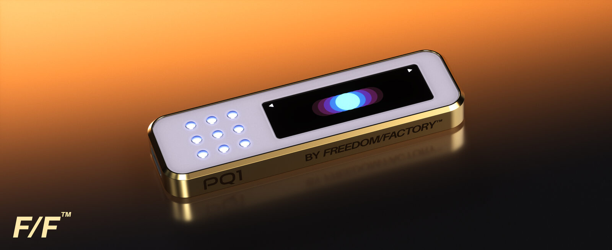

# PQ1

A **post-quantum ERC-4337 hardware wallet** (the **PQ1**) where every primitive that protects the seed — at rest, in transit between chips, in firmware updates, in transaction signing — is a NIST PQC standard or a Grover-resistant symmetric primitive. The secure elements' channel layers (which we cannot replace) are symmetric-rooted — no public-key handshake ever crosses a bus — so even against a future CRQC the strongest attack on recorded traffic is depth-limited Grover key search (NIST Category 1, the same floor as the SPHINCS+C10 signatures themselves).

**Target hardware:** STM32U585 (Cortex-M33, TrustZone) + Infineon OPTIGA Trust M V3 + NXP EdgeLock SE050. No single die, no single vendor, and no future cryptographically-relevant quantum computer (CRQC) should recover the seed from harvested traffic or extracted ciphertext.

**Build one yourself:** every part is off-the-shelf — [`DIY.md`](DIY.md) has the ~$150 bill of materials (Mouser links included), the wiring, and the first-flash guide.

> **Firmware-format authority correction — 2026-07-15.** The existing
> `PQFW_V1`/75-byte proof and implementation are legacy bench evidence only.
> Historical V4/80-byte text remains in some owner documents, while the
> more-specific Draft 1.1 describes V6/121 bytes as a research candidate with
> no implementation authority. No replacement schema is currently selected.
> Reconcile those owners before implementation or formalization; later V4
> passages in this README are historical candidate text, not current approval.

> **Status — 2026-04, pre-production bring-up. All-C10 cutover complete.**
> Every transaction is signed with **SPHINCS+C10** (W+C_F+C, `h=18, d=2, a=11, k=13, w=8, l=43, target_sum=205, sig=4008`) — hash-based, no lattice or number-theoretic assumptions, no classical fallback. The *same* primitive signs both Type 1 (bootstrap → slot registration) and Type 2 (slot → user tx); there is no FORS+C and no secp256k1/P-256/Ed25519 anywhere. The firmware boots and runs on a real **B-U585I-IOT02A** with the OPTIGA Trust M V3 Shield + NXP OM-SE050ARD on Arduino R3 headers, and on QEMU `mps2-an505`. Dual-SE XOR entropy split, three-way PIN-attempt consumption (MCU + OPTIGA + SE050), both SE drivers, and the Tier-1 SAES-CMAC(DHUK) KDF are validated end-to-end on silicon; the boot counter check is directionally MCU→OPTIGA E120 because the SE050 attempt count is not peek-readable. On-chain contracts (`PQSmartWallet` + factory + `PQMultiOwnable`) target **EntryPoint v0.6** behind cheap ERC-1967 proxies at a deterministic CREATE2 address keyed on `sha256(masterPkSeed‖masterPkRoot)`. SHA-256 throughout the PQ stack (routed to the STM32U585 HASH peripheral); Keccak-256 only for EVM-mandated hashes.
>
> **No devices have shipped and no on-chain wallets hold funds.** Anything described below as "frozen" or "a hard fork to change" is the shape the team intends to commit to *at launch* — domain tags, the C10 parameter set, the CREATE2 salt, and the EntryPoint version can all still be changed cleanly before first shipment. The bring-up branch carries known production-invariant regressions; see `CLAUDE.md` "Pre-Production Caveats".

```
                  ┌──────────────────────────────────────────────────┐
                  │              STM32U585  (Cortex-M33)              │
                  │                                                   │
                  │  ┌───────────────── SECURE WORLD ───────────────┐ │   ┌──── NON-SECURE WORLD ────┐
                  │  │                                                │ │   │                          │
                  │  │  PIN → gated_unlock (page-124 pre-commit)      │ │   │  USB HID / LCD forward   │
                  │  │     → SE-derived auth via hw::secret_keys      │ │   │  Companion app drives    │
   ┌──────────┐   │  │     → SAES-CMAC(DHUK, label) [Tier 1]          │ │   │  (chain_id, slot_index,  │
   │ OPTIGA   │◄──┼──┤                                                │ │   │   flags) per sign call   │
   │Trust M V3│   │  │  OPTIGA.unlock(K_O)  → half_O                  │◄┼───┼──►┌──────────────────┐  │
   │(Shielded │   │  │  (Shielded Conn AES-128-CCM-8;                 │ │   │   │ NSC gateway      │  │
   │  Conn,   │   │  │   E120 LUC + F1D0 AuthRef silicon-gated)       │ │   │   │ sign·unlock·     │  │
   │ E120 LUC)│   │  │                                                │ │   │   │ status·fw-update │  │
   └──────────┘   │  │  SE050.unlock(K_E)   → half_E                  │ │   │   └──────────────────┘  │
   ┌──────────┐   │  │  (SCP03 AES-CMAC + AES-CBC; admin UserID       │ │   │                          │
   │  SE050   │◄──┼──┤   keys: BHK prod; DHUK fallback; OTP dev)      │ │   │  no secrets, ever        │
   │  (SCP03  │   │  │                                                │ │   └──────────────────────────┘
   │  + admin │   │  │  E       = HKDF(half_O ⊕ half_E)               │ │
   │  UID)    │   │  │  bip39_seed ← PBKDF2-SHA512(BIP-39(E))         │ │
   └──────────┘   │  │  master = HMAC-SHA512("sphincs-c6-v1", seed)   │ │
                  │  │  master_sk / slot_sk ← sphincs_c10::keygen     │ │
                  │  │  type1_sig ← C10.sign(master_sk, userOpHash)   │ │
                  │  │  type2_sig ← C10.sign(slot_sk,   userOpHash)   │ │
                  │  │  verify-before-release (FI guard, both sigs)   │ │
                  │  │  zeroize on lock/timeout/tamper/brownout       │ │
                  │  │                                                │ │
                  │  │  TRNG / HASH / SAES (DHUK) / TAMP / BOR        │ │
                  │  │  Secure-only inactivity TIM · MCU PIN counter  │ │
                  │  └────────────────────────────────────────────────┘ │
                  └──────────────────────────────────────────────────┘
                                          ▲
                                          │  FSBL (current: legacy bench code;
                                          │  target: approved + WRP-protected)
                                          │  verifies C10+SHA-256 on bench; production
                                          │  rollback/factory authority remains blocked
```

## Design Properties

Each item below is implemented today (QEMU and/or real STM32U585), partial, or planned. See [Implementation Status](#implementation-status) for the per-item state.

- **Post-quantum signatures, one primitive everywhere** — SPHINCS+C10 for both Type 1 (bootstrap slot registration) and Type 2 (per-slot user tx). The on-chain contract has a single `c10Verifier` immutable wired to both dispatch paths. Per-chain caps `MAX_BOOTSTRAP_USES = MAX_SLOT_USES = 65,536` are immutable; combined ≈ 2³² user txns/chain before that chain is permanently frozen — well inside the C10 birthday margin. *(Implemented; `forge test` covers both paths.)*
- **Post-quantum firmware signing (pre-production)** — the existing V1/75-byte signer and FSBL verify SPHINCS+C10 artifacts on the bench, but their rollback/try-once backend is rejected and compile-blocked from production. Historical Draft 0.9/V4 is preserved as research evidence. Draft 1.1 proposes slot-bound manifest v6 and an exact 121-byte `PQFW_V6` preimage, but remains an unapproved research candidate; journal/ECC/OTP, FLASH, RAM/stack, release-policy, factory, and silicon gates remain open.
- **Symmetric-only SE tunnels (no harvestable handshake)** — no public-key
  exchange crosses I²C. The `rdp2-self-lock` candidate implements a journaled
  first-field transport→final transition before the seed wizard: SE050
  credentials become BHK-rooted and the OPTIGA PBS binds a persisted fresh
  TRNG salt to the DHUK derivation. This is not yet a production-approved
  ceremony: the authenticated factory handoff/receipt, old/new/KVN recovery
  proof, exact E140 order, and silicon evidence remain OPEN and
  production-blocking. Once that ceremony is closed, the accepted residual is
  Grover key search on AES-128 session keys (~2⁶⁴ serial, NIST Category 1 —
  the same floor as SPHINCS+C10 itself), per recorded session, requiring a
  physical tap during a live unlock, twice over thanks to the XOR split. *(An
  ML-KEM-1024 inner wrap was prototyped and descoped 2026-07-07 — owner
  decision; see `docs/security/ml-kem-inner-wrap.md`.)*
- **TrustZone isolation** — signing key, PIN state, key derivation, and crypto confined to the secure world. The NSC gateway (sign / batch-sign / off-chain sign / unlock / lock / status / wallet-address / init-code / firmware-update) is the only crossing point, with NS pointer validation and TOCTOU defense (NS buffers copied to S-stack before parse). On silicon the gateway runs through real ARMv8-M CMSE veneers (`make e2e-hw`); QEMU uses a shared-memory mailbox (workaround for a QEMU 8.2.2 MPC S-alias bug).
- **Dual secure elements (split entropy)** — BIP-39 entropy is XOR-split: `half_O` on OPTIGA, `half_E` on SE050. Either chip alone reveals zero bits. `E = HKDF(half_O ⊕ half_E)` happens only in S-SRAM during unlock, then zeroized. *(Validated on silicon; both on I2C1 at 0x30 / 0x48.)*
- **Three-way PIN-attempt enforcement** — every ordinary wrong attempt charges FI-hardened MCU page 124, OPTIGA E120 LUC, and the SE050 silicon UserID. Page 124 and SE050 enforce the user-facing 10-attempt bound; E120 is a separate 32-lifetime-attempt anti-extraction backstop. Boot checks the readable counters directionally (`E120_used > page124_used` means rollback/tamper); the SE050 attempt attribute is policy-denied and is not a boot input. `CMD_GET_REMAINING` uses page 124 plus runtime driver mirrors, not a three-way silicon read receipt. *Silicon evidence from `make pin-gate-hw-counter-e2e` covers per-attempt consumption/desync recovery within one run, and `make pin-gate-wipe-e2e` covers lockout/wipe. A reboot-based silicon receipt for both directional boot-ordering cases remains open; those branches are not claimed as hardware-E2E-validated.*
- **Three-tier DHUK + BHK + OTP key hierarchy** — Tier 1 (DHUK, `SAES-CMAC(DHUK, label‖counter)`) is **landed** behind `saes-dhuk`. At RDP0 the DHUK is an ST-substituted constant shared across boards (per-die uniqueness only at RDP ≥ 1). The Tier-2 BHK lifecycle and page-127 salted first-boot journal exist in the quarantined `rdp2-self-lock` candidate; production review and silicon evidence remain open.
- **Trusted-display clear-signing** — every signable artifact is decoded and rendered in S-world before confirm by **native on-device decoders**. **Safe** EIP-712 `SafeTx` and **CoW Swap** EIP-712 `GPv2Order` are verified in-world (`secure/src/tx/eip712/{safe,cowswap}/`) and decoded locally. **ERC-20** transfers and CoW order legs render symbol/decimals from a Merkle-verified metadata bundle; accepted **ERC-7730** descriptors, including supported Aave v3 operations, render field-level pages. Allowlisted `MultiSendCallOnly` DELEGATECALL batches are strictly decoded record-by-record. Only genuinely absent opaque calls/records may reach loud blind pages; registry-known/Bloom-positive calls without valid bound semantics, incomplete Aave descriptors, malformed or prohibited batches, other delegatecalls, and page-budget overflow refuse.
  The clear-signing guarantee covers structured on-chain and typed-data dispatch. Explicit EIP-1271 `RAW32` remains a separate `! BLIND RAW32` off-chain tier and must never be used by a companion to downgrade a typed-data request.
- **Boot-time self-test & measurement** — `hw::hash::init_clock()` runs a `SHA-256("abc")` KAT (halt on mismatch); `make saes-self-test-hw` runs the SAES round-trip + 8-byte DHUK fingerprint. The secure-world image hash is rendered as 8 BIP-39 words on the NV3007 LCD for trustless comparison against `fwmeasure`.
- **Hardening hooks** — STM32U585 TAMP (Trezor-port; log-only on this branch, production flips to `trigger_lockout_wipe()`), TIM2 CH1 PWM consumption mask (PA5), UI-capture screenshot-hash harness. All feature-gated; CI keeps them out of production.
- **No heap** — `#![no_std]`, stack-only, no `Vec`/`Box`/`String`. `zeroize` on every secret; `subtle` for constant-time compares; `// SAFETY:` on every `unsafe`.

## Quick Start

```bash
make play               # interactive QEMU — laptop arrow keys drive the two wallet buttons
make run                # mock-SE smoke test in QEMU
make e2e                # automated unified-sign e2e in QEMU (mock SE)
make e2e-hw             # automated e2e on real STM32U585 (dual-SE) via probe-rs
make test-key-speed     # DWT-timed signing bench on real hardware
make measure            # print the 8 BIP-39 measurement words for this build
```

| Key | Action |
|---|---|
| `←` | Left button — back / scroll down |
| `→` | Right button — next / scroll up |
| `←`+`→` | Confirm (press both together) |
| `Esc` / `Ctrl-C` | Cancel / quit |

Build a dual-SE **nonshipping bench** firmware (the explicit feature makes the
legacy rollback backend visible and is forbidden in production):

```bash
make FEATURES="dual-se,stm32u585,ui-lcd,saes-dhuk,usb,legacy-fw-rollback-unsafe" all
```

Expected real-hardware key-speed (`hw-sha256`, auto under `stm32u585`): first-sign ≤ 3 s (master keygen + slot keygen + 2× sign); Type-2 cached slot ≈ 1.1 s; second-chain first-sign ≈ 2.5 s. Substantially higher means the HASH peripheral isn't being used.

**HW probe-rs gotcha.** `probe-rs` doesn't implement semihosting `SYS_READC`, so `ui-semihosting` PIN prompts hang on real silicon. Use `make test-key-speed` (no reads) or `make play-hw-display` (arrow keys via the probe-rs handshake). QEMU is unaffected.

### Prerequisites

- Rust nightly (`rust-toolchain.toml`), `arm-none-eabi-ld`, QEMU with `mps2-an505`
- Hardware: B-U585I-IOT02A + OPTIGA Trust M V3 Shield (`TRUSTMV3SHIELDTOBO1`) + NXP OM-SE050ARD on Arduino R3 headers, driven via ST-LINK + `probe-rs`

## Project Structure

```
sphincs_rust/
├── secure/        TrustZone SECURE world (main.rs, crypto.rs, sau.rs, nsc/, aa/, tx/,
│                  optiga/, se050/, dual_se.rs, fw_update/, measured_boot.rs, ui/, hw/)
├── nonsecure/     NON-SECURE world: USB HID + APDU v2 router, NS gateway caller, e2e runner,
│                  generated erc20_db.bin / names_db.bin
├── shared/        Cross-world #[repr(C)] types, NscStatus, CMD constants, wire-format sizes
├── proto/         pqsigner-proto — protocol constants/enums/sizes (source of truth for Solidity)
├── sphincs-c10/   SPHINCS+C10 signing library (no_std, SHA-256)
├── bip39/         24-word English BIP-39 (no_std)
├── domain/ tx-core/ aa/ tx/ hal/ pqsigner-erc7730/   pure-logic workspace crates
├── contracts/smart-wallet/   Foundry project — PQSmartWallet, Factory, PQMultiOwnable,
│                             verifiers/SPHINCsC10Asm.sol (stateless Yul C10 verifier)
├── fsbl/          first-stage bootloader (legacy bench link: 32 KiB; Draft 1.1 resources OPEN)
├── fwsign/ fwmeasure/ fw-manifest/   host signer/verifier, measurement tool, manifest chain
├── dbgen/         host ERC20/names/selectors/ERC-7730 DB + Merkle-tree builder
├── tools/         webhid_test.html, wallet_run_hw.py, …
└── docs/          architecture.md, HARDENING.md, threat-model.md, …
```

See `CLAUDE.md` for the full per-file map and the non-negotiable invariants.

## Authenticated companion databases

The full catalogue blobs stay on the host/companion. Secure firmware pins only
their 32-byte Merkle roots (`secure/src/db_roots.rs`) and verifies every
companion-supplied lookup bundle before its metadata can reach the display.

| DB | Source | NS artifact | Secure anchor |
|---|---|---|---|
| ERC20 metadata | `secure/data/erc20.json` | `tools/companion-stub/erc20_db.bin` | `ERC20_DB_ROOT` |
| Address names | `secure/data/names.json` | `tools/companion-stub/names_db.bin` | `NAMES_DB_ROOT` |
| Function selectors | `secure/data/selectors.json` | `tools/companion-stub/selectors_db.bin` | `SELECTOR_DB_ROOT` |
| ERC-7730 descriptors | `secure/data/erc7730-registry/{registry,ercs}/**/*.json` + `secure/data/erc7730/policy.toml` | `tools/companion-stub/erc7730_db.bin` | `ERC7730_DESCRIPTORS_ROOT` |

`cargo run -p dbgen` reads the pinned inputs, builds the SHA-256 Merkle trees,
appends per-entry proofs, and writes the `.bin` files plus `db_roots.rs`. All
generated files are committed. `nonsecure/build.rs` checks the small E2E blobs
used by the QEMU companion stub; production firmware embeds no catalogue blob.
The trust chain is fully offline: firmware-signing key → root in secure flash →
Merkle proof walk → verification. Catalogue changes must go through the pinned
vendor/install workflow, regenerate with `dbgen`, and pass `make check-codegen`.

## Cryptographic Primitives

Every primitive that touches a secret, with PQ status. **Classical** entries are display-only (never reach the seed), a residual SE-vendor surface we wrap with planned PQ confidentiality, or a planned migration.

| Where | Primitive | Size | PQ | Notes |
|---|---|---|---|---|
| **Tx signing (Type 1 + 2)** | SPHINCS+C10 (W+C_F+C, h=18 d=2 a=11 k=13 w=8 l=43 target_sum=205) | sig 4008 B, pk 32 B | ✅ | One primitive for bootstrap *and* per-slot. Verifier `SPHINCsC10Asm.sol` runs in-EVM via the SHA-256 precompile. The on-chain `SignatureWrapper(ownerIndex, sig)` is 4128 B (4008 padded to 4032 + 3×32 header) |
| **Firmware signing** | SPHINCS+C10 (same params) | sig 4008 B | ⚠️ | Legacy V1 bench path exists. Draft 1.1 proposes manifest-v6 but is not implementation-approved; production remains blocked on its journal/ECC/OTP, FLASH, RAM/stack, release-policy, factory, and silicon gates. No classical fallback |
| **OPTIGA wire** | Shielded Connection: TLS-PRF + AES-128-CCM-8; candidate final PBS is DHUK-derived and binds a persisted TRNG salt | tag 8 B | ⚠️ | Symmetric-rooted (no Shor surface). Candidate code exists; authenticated factory handoff, recovery proof, E140 ordering, and silicon evidence remain production-blocking. Only after that closure does the accepted Grover-2⁶⁴ tapped-session residual apply |
| **OPTIGA PIN gate** | AuthRef (`0xF1D0`) + E120 LUC (silicon-monotonic) | — | ✅ | Trezor-parity; immune to PBS extraction. Hardware-cleared by `Change=Auto(F1D0)` over transient auth on success |
| **SE050 wire** | SCP03 (AES-CMAC + AES-CBC); candidate final credentials use the BHK derivation axis | k 16/32 B | ⚠️ | Symmetric-rooted (no Shor surface). The journaled transport→BHK candidate exists, but its handoff and old/new/KVN recovery contract plus silicon evidence remain unapproved. Session keys have no forward secrecy |
| **SE050 PIN gate** | UserID auth (constant-time, max 10) | — | ✅ | Hardware retry counter; surfaces only via `SW=0x63Cx` |
| **SE050 admin PIN** | Current helper: `SAES-CMAC(BHK,…)`; DHUK fallback; OTP only in explicit dev/legacy builds | 16 B | ⚠️ | Derived on demand and never stored as a flash PIN. Page 126 holds the wrapped BHK. The candidate first boot rekeys the transport UserID to this final helper; production validation and recovery authority remain OPEN |
| **MCU PIN counter** | Page-124 quad-word programs | 10-attempt cap | ✅ | FI-hardened pre-commit in `nsc::gated_unlock`: bump *before* touching the SE driver, with post-bump readback (`+1` or `InternalError`) |
| **SE chip attestation** | ECDSA over a vendor curve | — | ❌ | Proof-of-presence only; cryptographic device identity will be a pinned SPHINCS+C10 cert (planned) |
| **Tier 1 root** | STM32U585 DHUK via SAES `KEYSEL=001`; `SAES-CMAC(DHUK, label‖counter)` | 16 B/block | ✅ | DHUK never CPU-visible. RDP0 = ST constant; per-die uniqueness at RDP ≥ 1 |
| **Tier 2 root (planned)** | BHK — TRNG-burnt, DHUK-wrapped, TAMP-backup-loaded, `SECCFGR`-locked | 32 B | ✅ | Defense in depth; planned to host SE050 SCP03 |
| **Factory transport root** | Per-device OTP master, TRNG-generated and burned by the factory before shipment | 32 B | ✅ | Derives only the initial SE050 SCP03/admin and OPTIGA PBS transport credentials. Field firmware must never auto-burn it or reuse it as a final device root; the candidate first boot replaces those transport credentials after RDP-2. |
| **BIP-39 → C10 master** | PBKDF2-HMAC-SHA512 (2048) → `HMAC-SHA512("sphincs-c6-v1", seed)` (acct 0) / `…("sphincs-c6-v1-acct", seed‖acct_be4)` (accts 1..=255) | 64 B | ✅ | `"c6"` tag is historical (carried through the C10 cutover). Acct 0 reproduces the legacy derivation byte-for-byte |
| **Slot derivation** | `slot_entropy = sha256(slot_master‖"slot_entropy"‖chain_id_be8‖slot_index_be4)`; `slot_sk_seed = sha256("slot_c10_sk_seed"‖slot_entropy)`; `slot_pk_seed = sha256("slot_c10_pk_seed"‖slot_entropy) & N_MASK` | 32 B sk, 16 B pk | ✅ | **Chain-bound** (post-Coinbase port): slot keys differ per chain. Stateless within the 2¹⁸ tree; cached in SRAM for the unlock session only |
| **Anti-rollback floor** | Draft 1.1 research candidate | — | ⚠️ | Ordinary releases within one security epoch would consume no OTP. The candidate is not implementation-approved; the physical codec/capacity, interruption recovery, ECC handling, resource fit, and silicon evidence remain OPEN. The legacy 1,024-bit tally is invalid on STM32U585 and production-fenced |
| **TRNG mixing** | STM32 TRNG today; planned ⊕ OPTIGA ⊕ SE050 TRNG | 32 B | ✅ | Quantum offers nothing against true randomness |
| **Clear-sign decoders** | Native on-device decode (Safe / CoW / ERC-7730 / ERC-20 / typed-call) | — | ❌ | Display-only — gates *what is shown before signing*, never reaches the seed. |
| **Clear-sign DB auth** | SHA-256 Merkle tree over pinned leaves; 32-byte root in secure flash | root 32 B | ✅ | Anchored to the firmware-signing key; fully offline (no on-chain governance lookups) |

**Choices frozen at launch** (changing any reproduces a different keypair / on-chain address — today a re-provisioning cost on bench boards, not a user-visible fork):

| Parameter | Value |
|---|---|
| Signing parameter set | SPHINCS+C10 (h=18 d=2 a=11 k=13 w=8 l=43 target_sum=205, sig 4008) |
| BIP-39 → C10 master | `HMAC-SHA512("sphincs-c6-v1", seed)` (acct 0) / `…-acct‖acct_be4` (accts 1..=255) |
| Master pubkey shape | `masterPkSeed = sha256("pk_seed"‖master[..32]) & N_MASK`; `masterSkSeed = sha256("sk_seed"‖master[..32])` |
| CREATE2 salt | `sha256(masterPkSeed ‖ masterPkRoot)` — same address on every chain for a given `account_index` |
| Slot tags | `"slot_entropy"`, `"slot_r"`, `"slot_c10_sk_seed"`, `"slot_c10_pk_seed"`, `"pqwallet-slot-master"(-acct)` |

## Quantum Threat Model

**The dominant threat is Harvest Now, Decrypt Later (HNDL):** an adversary records all I²C traffic today and decrypts it once a CRQC exists. For a wallet holding long-term funds this matters because the adversary need not be present at decryption time.

**How the shipping design defeats HNDL:** there is nothing Shor-breakable to
harvest. Every signature is hash-based, and both SE tunnels use pre-shared
symmetric roots — no ECDH, RSA, or KEM handshake crosses I²C or USB. The
quarantined `rdp2-self-lock` candidate implements the journaled first-field
rotation: BHK-rooted SE050 credentials and a DHUK-rooted OPTIGA PBS bound to a
persisted fresh TRNG salt. The authenticated factory handoff/receipt,
old/new/KVN recovery proof, E140 ordering, and silicon evidence remain OPEN and
production-blocking. Once closed, a recorded bus trace can only be attacked by
Grover key search on an AES-128 session key: ~2⁶⁴ *serial* quantum operations
(NIST Category 1 — the identical floor SPHINCS+C10's n=16 parameters sit at),
per session, and the sensitive payloads (PIN, entropy halves) only cross during
a live unlock, so harvesting requires a physical interposer on a powered
device. The XOR split then demands two independent such breaks on two different
buses under two different keys. **Accepted residual (owner decision
2026-07-07):** this Grover-2⁶⁴-with-physical-tap bound is the design's floor for
bus confidentiality; a prototyped ML-KEM-1024 inner wrap that would have lifted
stored-half confidentiality above it was descoped (retained feature-gated
in-tree — `docs/security/ml-kem-inner-wrap.md`). Because session keys derive
deterministically from the statics (no forward secrecy), this acceptance
depends on completing the per-device final-rotation ceremony — fleet-shared or
reconstructible final statics would invalidate it.

**Residual classical surface we accept:** OPTIGA Shielded Connection KDF (symmetric-only; worst case Grover-accelerated PBS brute force, still > 128-bit PQ); SE050 secure-channel auth (MITM needs real-time physical bus tampering on a powered device; a MITM'd half is still only one XOR share); SE factory attestation (ECDSA — proof-of-presence only); OPTIGA/SE050 internal firmware (single-chip compromise leaks zero seed bits); U585 RDP-2 + HUK-SAES (the irreducible "extract the specific die" attack).

**We explicitly do *not* defend against:** coerced unlock; an active CRQC adversary with sustained physical access to a powered, unlocked device; a fundamental break of SPHINCS+ / SHA-256 (civilization-scale; recovery is a firmware update to a SHA-3/SHAKE-based scheme); side-channel / fault attacks on U585 silicon (orthogonal to PQ; mitigated by TAMP / consumption-mask / verify-before-release / FI-hardened `gated_unlock` + `docs/security/HARDENING.md`).

**Why hash-based signatures for the actual money:** lattice schemes rely on LWE hardness with a far younger cryptanalytic track record than hash functions. For the signing key and firmware signing we use SPHINCS+C10, whose only assumption is SHA-256 — with the inner-wrap descope, no lattice assumption appears anywhere in the shipping trust path.

### Why two secure elements?

A single SE is a single point of trust. The production target pairs **OPTIGA Trust M V3** (CC EAL6+ AVA_VAN.5, Shielded Connection) with **NXP SE050** (CC EAL6+ AVA_VAN.5, SCP03 + UserID) so a vendor-level break of either must overlap with one of the other to recover the seed.

| Attack | Single-SE | Dual-SE (this design) |
|---|---|---|
| Class-break on one vendor's firmware / invasive die attack | seed exposed | other half still secret — zero bits leaked |
| Backdoored RNG in one chip | biased entropy | XOR with the other SE's TRNG + STM32 TRNG preserves uniformity |
| Stolen powered-off device | one retry counter | three attempt gates: page 124 + SE050 enforce 10 attempts, E120 provides a 32-lifetime-attempt backstop; exhaustion/blocked auth drives the full admin-wipe path |
| U585 secure-SRAM compromise during active unlock | full break | full break (irreducible window — minimised by 120 s timeout + TAMP/BOR wipe ISR) |

Cost: one extra I²C peripheral, ~$3 BOM, ~50 ms unlock latency.

## Security Model

| Layer | Protection |
|---|---|
| **Seed at rest (OPTIGA)** | `half_O` in object `0xF1D1`, `Read = Auto(0xF1D0) + Conf(0xE140)` — readable only after an AuthRef HMAC-SHA-256 challenge against the PIN-derived `0xF1D0` *and* through the AES-128-CCM-8 Shielded Connection |
| **Seed at rest (SE050)** | `half_E = E ⊕ half_O` in an SE050 binary object whose read policy is bound to a UserID opened only inside SCP03. Current bring-up admin/SCP03 material uses the BHK axis; DHUK is the non-BHK fallback and OTP is dev/legacy only. The production-final fresh-TRNG rotation remains OPEN as described below |
| **Seed reconstruction** | `E = HKDF(half_O ⊕ half_E)` only in S-SRAM, for microseconds, then zeroized. Mnemonic / seed / master / slot keys recomputed on demand, dropped on lock / idle / panic |
| **Key transport** | OPTIGA Shielded Connection (TLS-PRF + AES-128-CCM-8) and SE050 SCP03. Current bring-up material comes from deterministic `hw::secret_keys` helpers (DHUK-derived OPTIGA PBS, BHK-axis SE050 credentials); legacy dev fallback is quarantined. These helpers are not production-final. The required fresh-TRNG final rotation, durable public salt/state, cut recovery, and exact E140 ordering remain OPEN and production-blocking. Flash page 126 is reserved for the wrapped SE050 BHK when enabled; it is not PBS storage |
| **PIN handling** | Raw PIN never leaves S-world; the trusted UI runs entirely in S-world. NS never sees a digit, cursor, or confirm decision. SE challenges derived via `hw::secret_keys` so neither chip stores the PIN |
| **Retry counters** | Three-way per-attempt consumption (MCU page 124 + OPTIGA E120 LUC + SE050 UserID); boot cross-check is directional page124→E120, while SE050 independently enforces max-10 lockout |
| **Boot self-tests** | `SHA-256("abc")` KAT (halt on FAIL); `make saes-self-test-hw` SAES round-trip + DHUK fingerprint. Production gates the self-test feature out |
| **TAMP / SCA mask** | TAMP monitors backup-domain voltage, LSE, JTAG/SWD@RDP>0, crypto fault, IWDG (log-only on this branch; production flips to `trigger_lockout_wipe()`). TIM2 CH1 PWM consumption mask on PA5 |
| **Memory isolation** | TrustZone (SAU + IDAU + MPC + GTZC); DMA into secure SRAM blocked; NS pointer validation + TOCTOU defense; no panics across NSC |
| **Inactivity / power loss** | Secure-only TIM enforces a 120 s idle wipe; TAMP and BOR fire the same ISR; bulk cap sized so the ISR completes under brownout |
| **Crash safety** | Panic handler zeroizes secrets and resets before halting; idempotent `wipe-for-wizard` dev recovery path |
| **Production lockdown** | **Not authorized yet.** Draft 1.1 proposes an immutable pages-0..4 FSBL envelope, but FLASH/RAM, option-byte, factory, and silicon gates remain open. The RDP/WRP/self-provision sequence in work-todo #36 is research input, not an executable ceremony. |

### Boot → Unlock → Sign → Lock

Every step runs in the **secure world**; NS drives nothing more sensitive than "show this string" / "button pressed".

```
1. SECURE BOOT      FSBL verifies the SPHINCS+C10 sig of both images → SAU/IDAU/MPC/GTZC →
                    mark LCD bus, button GPIOs, both SE buses, TRNG/HASH/SAES/PKA/TAMP/BKPSRAM
                    Secure-only → SHA-256 KAT (halt on FAIL) → SAES self-test (feature-gated)
2. ATTESTATION      (planned) nonce ← TRNG; verify each SE's factory cert vs pinned vendor root +
                    pinned UID. FAIL → tamper screen + halt. PASS → boot NS, show "Enter PIN"
3. PIN ENTRY        trusted path entirely in S-world; raw digits only in S-SRAM; NS never sees them
4. gated_unlock     pre := page-124 read; bump; if read != pre+1 → InternalError (FI guard, refuse
                    SE driver). Derive PBS / SCP03 / admin via secret_keys. OPTIGA: Shielded Conn +
                    F1D0 AuthRef (E120-gated) → read half_O. SE050: SCP03 + UserID → read half_E.
                    Correct PIN → reset all 3 counters. 10th wrong on ANY → factory_reset_admin +
                    page-124 erase + page-125 wipe-flag → cold boot enters the wizard
5. RECONSTRUCT      E = HKDF(half_O ⊕ half_E); zeroize halves; BIP-39 → seed → master →
                    master_sk; slot keys derived per-call from (slot_master, chain_id, slot_index),
                    cached in SRAM only
6. ACTIVE WINDOW    ≤ 120 s inactivity (Secure-only TIM; NS pings ignored). Per CMD_SIGN_USEROP:
                    parse → draw decoded fields → (re)keygen slot if uncached → user CONFIRM →
                    C10.sign (Type 1 if FLAG_REGISTER_SLOT, always Type 2) → verify-before-release
                    → emit [type1_len|t1|type2_len|t2] bundle → reset timer
7. LOCK / WIPE      120 s idle, TAMP, BOR, any NSC panic, or a sign-verify mismatch → zeroize all
                    cached secrets + stack + registers, loop-twice + verify → "Locked" screen
```

**Invariants the dual-SE design hangs on:** (1) the trusted path is contiguous button → S-ISR → LCD → S-world (GTZC marks all of it Secure-only); (2) the PIN buffer never crosses the NSC boundary — there is no `enter_pin(bytes)` call, only `request_unlock()`; (3) activity is defined by S-world button presses, never NS pings; (4) every ordinary PIN attempt is charged through page 124 and both SE auth paths, while boot can only perform the documented directional page124/E120 rollback check; (5) the firmware is stateless w.r.t. slot selection — no `next_q`-in-flash, no per-signature flash writes (slot keys re-derived on demand; SPHINCS+C10 is stateless within its 2¹⁸ tree).

## Formal Verification (Lean 4)

Two machine-checked proof tracks, one shared specification. A proof applies to
a shipped release only when an identity-bound receipt connects that exact
release artifact to its source, configuration, generated models, toolchain,
assumption closure, and proof result. Frozen parameters or wire formats alone
do not establish that correspondence. A release may be separately authorized
without FV, but it must not be described retrospectively as verified without
that binding.

**On-chain track (established).** `contracts/verification/` holds a Lean 4
specification of SPHINCS+C10 verification (`SphincsCVerify/Spec/` — WOTS, FORS,
ADRS, hypertree) plus wallet-model theorems (`theft_free` and its per-claim
corollaries: caps are unresettable, the bootstrap key can't be removed, the
CREATE2 address is chain-independent, EIP-1271 forbids the bootstrap key).
Every proof is re-checked by the Lean kernel; the remaining trust surface is a
small, *named* axiom list (`docs/AXIOM_STATUS.json`) — e.g. "the SHA-256
precompile implements FIPS 180-4" — each entry carrying its discharge artifact
(NIST CAVS known-answer tests, Halmos bytecode sessions against pinned
codehashes, or a citation). CI enforces no-`sorry` and lints the axiom list.

**Firmware track (in progress — work-todo §33).** The pure-logic firmware
crates (`sphincs-c10`, `aa`, `domain`, the wire-format parsers) are translated
to Lean with [Charon](https://github.com/AeneasVerif/charon) +
[Aeneas](https://github.com/AeneasVerif/aeneas), then proven equivalent to the
*same* `SphincsCVerify` spec the on-chain verifier was proven sound against.
Proof grinding is designed to be mostly AI-driven (a scheduled prover loop in
CI; the Lean kernel re-checks every proof, so AI output can never compromise
soundness), with an adversarial spec-validation layer — property-based
counterexample search on every spec before proof effort, plus differential
fuzzing of the executable Lean spec against the real Rust crate on the host.
Research and tool selection: [docs/verification/lean-verification-research-2026-06.md](docs/verification/lean-verification-research-2026-06.md).

What this unlocks, in value order:

1. **Firmware↔chain binding.** The headline goal theorem must show that the
   bytes the firmware signs over a parsed sign-request are exactly the custom
   SHA-256 `PQSmartWallet.sphincsDigest(userOp)` the wallet recomputes—not the
   EntryPoint canonical keccak `userOpHash`, which this wallet ignores. The
   existing extracted `compute_user_op_hash` theorem is tooling-only; the
   production `compute_sphincs_digest_v06` bridge remains open. No finite test
   suite can close that gap exhaustively; a current-source theorem can.
2. **Signer/verifier correspondence.** The firmware's C10 signer and the
   on-chain verifier proven against one spec, ending any possibility of
   silent algorithmic drift between the two implementations.
3. **Panic-freedom on the attacker-facing parsers** (USB → wire-format), as a
   machine-checked DoS-hardening property — near-free under Aeneas's monadic
   translation.

**Status (2026-06):** extraction pipeline works end-to-end on `sphincs-c10`
(the crypto core — ADRS/WOTS/FORS/Merkle/hash — extracts cleanly after small,
test-pinned refactors; three UI-plumbing error sites remain). No firmware
theorem is proven yet; the first equivalence targets are
`address.rs ↔ Spec/Adrs.lean`.

**Honest scope.** A kernel-checked theorem here means: *proven, modulo the
enumerated axiom list, Aeneas translation fidelity, and rustc*. It says
nothing about side channels, fault injection, or silicon behaviour — those
remain covered by the SCA/FI bench (`tools/sca/`) and on-silicon validation.
Any claim of "verified" in docs or marketing must carry the assumption list.

## Implementation Status

🟢 tested (QEMU and/or real STM32U585 silicon) · 🔵 code exists, untested/partial · ⏳ not started · 🚫 blocked on hardware/lab

| Component | Status |
|---|---|
| TrustZone partitioning (SAU + IDAU + MPC/GTZC) | 🟢 QEMU + HW (TZSC enforcement + USB coexistence silicon-validated 2026-05-20; only TAMP/GTZC2 follow-up open) |
| NSC gateway (NS pointer validation, CMSE veneers / mailbox) | 🟢 QEMU + HW |
| BIP-39 → SPHINCS+C10 derivation, master + per-slot, multi-account (256/seed) | 🟢 QEMU + HW |
| OPTIGA Trust M V3: IFX I2C + APDU + Shielded Connection | 🟢 HW |
| OPTIGA E120 LUC silicon PIN counter + F1D0/E120 transient-auth reset | 🟢 HW |
| SE050: T1oI2C + APDU + SCP03; admin-wipe e2e | 🟢 HW |
| Dual-SE XOR entropy split; MCU page-124 FI-hardened counter; three-way PIN-attempt enforcement | 🟢 HW |
| Tier 1 SAES-CMAC(DHUK) KDF + SAES driver self-test | 🟢 HW |
| `sphincs-c10` library; HW SHA-256 routing (HASH peripheral, boot KAT) | 🟢 QEMU + HW |
| Trusted UI (NV3007 LCD + 2-button), seed wizard / PIN entry / confirm dialogs | 🟢 QEMU + HW |
| `#![no_std]`/no-heap/zeroize, panic-handler wipe, inactivity timeout | 🟢 QEMU + HW |
| Native clear-sign (Safe / CoW / ERC-7730 / ERC-20); Merkle-verified DBs | 🟢 QEMU |
| EIP-712 Safe + CoW Swap verifiers; ERC-7730 renderer | 🟢 QEMU |
| Automated e2e (`make e2e` QEMU; `make e2e-hw` silicon) | 🟢 |
| ERC-1967 proxy contracts (PQSmartWallet + Factory + PQMultiOwnable), Foundry suite | 🟢 |
| Hash-signature firmware update (FSBL + `fwsign` + `fw-manifest` + streaming `fw_update/`) | ⚠️ legacy bench implementation; Draft 1.1 is an unapproved research candidate; production blocked on software, resource, factory, and silicon gates |
| Firmware measurement at boot (SHA-256 → 8 BIP-39 words) | 🟢; bit-packed shared rendering verified |
| Firmware rollback journal + typed OTP floor | 🚫 production-blocked pending software backend, resource gates, and later owner-authorized silicon evidence |
| TAMP driver (log-only); consumption-mask hook | 🟢 implemented |
| Tier 2 BHK; boot-time attestation; device-identity cert | ⏳ not started |
| ML-KEM-1024 inner wrap | 🚫 descoped 2026-07-07 (owner decision — accepted Grover-only bus residual; prototype retained feature-gated) |
| Mixed-RNG (STM32 ⊕ OPTIGA ⊕ SE050 TRNG); PIN-entry digit scrambling | 🔵 partial / ⏳ |
| Custom PCB; HUK-SAES at-rest wrap; production TAMP wipe; first-boot RDP-2 self-lock validation (work-todo #36); FI/SCA lab | 🚫 blocked on HW |

## Firmware Update Model

A **hash-signature** model combining open-source reproducible builds with manufacturer approval — end-to-end SPHINCS+C10 + SHA-256, no classical fallback.

```
Candidate:     Draft 1.1 proposes manifest-v6 over an exact 121-byte `PQFW_V6` preimage
               binding slot, versions, image lengths/hashes, and vendor-key fingerprint.
FSBL (target): verify both slots, decode typed marker/floor state, select under the candidate
               state machine, and establish a security-epoch floor only after CONFIRMED.
Device (target): stream and verify a candidate, enter restricted probation, complete the
               candidate health protocol, then seal CONFIRMED. Runtime never writes the floor.
```

- **One PQ algorithm in the verification path** — the FSBL has one pubkey and one algorithm; a "just in case" classical fallback would defeat the PQ property, so there is none.
- **Signing the preimage IS signing the firmware** — once approved and implemented, SHA-256 collision resistance would tie Draft 1.1's proposed 121-byte, slot-bound V6 preimage to the exact binaries, lengths, vendor key, and rollback tuple. No such implementation authority exists yet.
- **Epoch split** — ordinary releases only advance `release_version`; OTP is consumed only when `security_epoch` revokes older vulnerable releases. The physical OTP design is still open and production-blocked.
- **PIN unlock required on every `CMD_FW_*`** (the seed is never accessed, but this blocks silent re-flash of a stolen device). The at-rest vendor SK is Argon2id + XChaCha20-Poly1305 wrapped — only on the signing machine, never on the device.

See [docs/firmware/firmware-update.md](docs/firmware/firmware-update.md) and [docs/firmware/reproducible-builds.md](docs/firmware/reproducible-builds.md).

## Build Modes

| Feature | Description |
|---|---|
| `mock-se` | Mock SE in SRAM (QEMU default) |
| `optiga-trust-m` / `se050` | Real OPTIGA Trust M V3 / SE050 via I2C1 |
| `dual-se` | Both production SEs + XOR entropy split (implies `optiga-trust-m` + `se050`) |
| `optiga-hw-counter` | Silicon OPTIGA PIN counter via E120 LUC bound to F1D0 Execute. **Destructive on first provisioning** |
| `spi1-arduino` | SPI1 on the Arduino R3 headers (PE12–PE15; implied by `ui-lcd`) |
| `saes-dhuk` / `saes-self-test` | Tier-1 `SAES-CMAC(DHUK)` KDF / boot self-test of the SAES driver |
| `tamp` / `consumption-mask` | TAMP (log-only on this branch) / TIM2 CH1 PWM SCA mask on PA5 |
| `stm32u585` | Real hardware target (vs QEMU `mps2-an505`). **Implies `hw-sha256`** |
| `hw-sha256` | Route `sphincs-c10` SHA-256 through the HASH peripheral |
| `ui-semihosting` / `ui-lcd` / `ui-noop` | Console (QEMU) / NV3007 SPI LCD / silent |
| `usb` | USB OTG init |
| `debug-log` / `e2e-test` / `mock-se` / `otp-hardcoded-master-key` / `ui-capture` | **Dev/test only — CI gates these OFF for production** |

Mode aliases: `mode-production` (no dev features) · `mode-bringup` (`debug-log`) · `mode-e2e` · `mode-bench`.

## Bring-up Roadmap

Each phase has a hard exit criterion before the next starts. Full backlog: the `EthereumPhone/PQ1` issue tracker (labels `source:work-todo` / `source:production-todo`).

- **Phase 0 — bring-up complete (today).** All-C10 firmware boots on the B-U585I-IOT02A; dual-SE split, three-way PIN-attempt enforcement, Tier-1 DHUK KDF, OPTIGA Shielded-Connection unlock, SE050 admin-wipe, and the FSBL firmware-update path all run end-to-end. The directional boot cross-check and known production-invariant regressions are stated in `CLAUDE.md`.
- **Phase 1 — close the bring-up regressions (in progress).** Restore the GTZC `TZSC_SECCFGR` allowlist (incl. GTZC2 USB-OTG); strip `debug-log`/`e2e-test`/`mock-se` from production builds + restore the `compile_error!` fences; remove dev log/register dumps; wire TAMP IRQ → `trigger_lockout_wipe()`; move BOR/inactivity to the Secure-only TIM; land Tier 2 (BHK); step a board to RDP1 and re-validate per-die DHUK uniqueness.
- **Phase 2 — boot-time attestation (still on the devkit).** Pin a SPHINCS+C10 device-identity cert; implement mixed-RNG and PIN digit scrambling. (The ML-KEM-1024 inner wrap formerly in this phase was descoped 2026-07-07 — owner decision; bus confidentiality rests on the symmetric-rooted tunnels + per-device key rotation.) Exit: attestation verified at boot; halves cross the bus only under per-device-keyed AEAD (trace-verified).
- **Phase 3 — custom PCB, HUK-SAES, GTZC, production peripheral set.** Design/review the PCB (U585 + both SEs + NV3007 LCD + buttons + tamper mesh + EMI can); HUK-SAES wrap the at-rest secrets; GTZC-mark every Secure-only peripheral; MPU boundaries; block DMA into S-SRAM; wire case switch / tamper mesh / temp sensor / BOR to the wipe ISR (measure bulk-cap holdup on real HW).
- **Phase 4 — secure boot, provisioning, lockdown (blocked).** Approve an exact
  successor to the Draft 1.1 research candidate, close its rollback
  backend/resource gates, and produce a replacement factory receipt before
  defining any irreversible ceremony. Sacrificial-unit
  and RDP2 work is explicitly outside the current software-only milestone.
- **Phase 5 — pre-launch validation.** External audit, FI + SCA lab time on the locked PCB, public bug bounty before any sale, gradual rollout with a long observation window.

## Pre-Production Shipping Checklist

Nothing here is optional. Run through the entire list **per device class**, not per software release. Each item is something that has bricked, leaked, or burned a hardware-wallet vendor in the last decade.

**A. Hardware design & PCB** *(full spec: [`docs/hardware/hardware_requirements.md`](docs/hardware/hardware_requirements.md))*
- [ ] PCB review by an embedded-security specialist (not the layout engineer)
- [ ] Evaluate moving SE050 off the shared I2C1 (0x30 / 0x48) to a second peripheral; independent reset for each SE
- [ ] No test pads / debug headers / probe points on any SE bus, LCD bus, button GPIO, or S-world peripheral
- [ ] Tamper mesh across all four layers over U585 + both SEs; case switch → TAMP with pull + noise filter
- [ ] BOR threshold + bulk capacitance **measured on real HW** so the wipe ISR completes before V_dd collapses
- [ ] Temperature sensor across the operating envelope; cold-boot threshold tested; retain only the SWD + NRST verification pads required for pre-first-power inspection, with no JTAG or second debug header (first field boot self-locks RDP-2 and disables debug in silicon)
- [ ] EMI can over U585 + both SEs; power-rail filtering vs ripple-injection; no glitchable clock to S-world peripherals
- [ ] Second-source every BOM part (an OPTIGA/SE050 stockout must not force a swap that breaks pinned attestation)

**B. Provisioning facility**
- [ ] Clean-room, no network / removable media / personal devices; reproducible, signed, re-imaged station OS per batch
- [ ] HSM-backed factory trust-anchor, attestation, and per-device transport-key ceremonies (or EdgeLock 2GO for SE050 at volume); two-person rule on HSM roots. The line must not generate or retain final pairing secrets.
- [ ] Per-device transport SCP03/PBS state and UID bindings are installed at the factory; the final pairing rotation happens on-device after first-field RDP-2 self-lock. Current code's deterministic DHUK/BHK helpers are not the still-open final salted-rotation protocol.
- [ ] Logs never contain secret material (CI scan for high-entropy strings); tamper-evident packaging; signed per-batch report
- [ ] Provisioning-station compromise plan (detect / scope / notify); quarantine + manual review for any post-provisioning failure

**C. Firmware build pipeline**
- [ ] **Reproducible builds** — same git SHA → byte-identical image, verified in CI on every push; toolchain pinned + archived per release
- [ ] All git deps pinned to a commit hash; `cargo audit` + `cargo deny` clean (fail on advisory); `cargo-geiger` archived per release
- [ ] `#![deny(unsafe_op_in_unsafe_fn, clippy::indexing_slicing)]`; every `unsafe` has a reviewed `// SAFETY:`
- [ ] LTO + overflow checks on; debug info / semihosting / panic strings stripped from the production image
- [ ] No `debug-log`/`e2e-test`/`mock-se`/`otp-hardcoded-master-key`/`ui-capture` in production (CI-gated); SBOM signed per release
- [ ] Release artifacts signed by an HSM release key, hash published via ≥ 2 channels; built on an air-gapped host

**D. Cryptographic verification**
- [ ] SPHINCS+C10 test vectors pass on-target; output matches `SPHINCsC10Asm.sol` byte-for-byte; differential test vs a second HBS impl
- [ ] BIP-39, HKDF PIN-stretch, HKDF-SHA256, SHA-512, AES-256-GCM (SAES path) test vectors pass
- [ ] SCP03 + Shielded-Connection + attestation negative tests (replay, malformed, wrong keys/UID, timeout)
- [ ] PIN brick test (nine prior wrong attempts, then the tenth wrong attempt bricks exactly once, verified by zeroized r-mem read-back); power-loss tests at every step of every flow
- [ ] Three-way per-attempt test plus directional page124/E120 rollback cases (`make pin-gate-hw-counter-e2e` is the starting point); full recovery test on a fresh device B

**E. Side-channel & fault hardening**
- [ ] External FI lab (voltage / EM / clock glitch) against PIN entry, attestation, signing, wipe; SCA lab (SPA/DPA) with and without the EMI can + consumption mask
- [ ] Constant-time inspection of the *generated assembly* for every secret-dependent SPHINCS+C10 loop (`subtle` is a contract, not a guarantee)
- [ ] Verify-before-release wired into every signing path; wipe ISR loop-twice + read-back verified under brownout and TAMP
- [ ] Stack scrub + CPU register scrub + cache flush after every secret-touching routine; cold-boot mitigation (freeze-spray tested); DMA-into-S-SRAM denied by GTZC

**F. STM32U585 secure boot & option bytes** *(how-to: "Locking the STM32 to your firmware only" below)*
- [ ] Approve an immutable SPHINCS+C10 FSBL artifact, final page geometry, both-bank protection, and factory ceremony. Draft 1.1's pages-0..4 proposal grants no burn authority (work-todo #36).
- [ ] FSBL refuses any slot whose preimage sig doesn't verify (CI flips one bit, confirms halt); image verification before any of your code runs
- [ ] C10 vendor sk lives only in an air-gapped HSM (Argon2id + XChaCha20-Poly1305 at-rest wrap, two-person rule, no on-disk copies)
- [ ] `TZEN=1`; devices ship at **RDP-0** for pre-first-power user verification and the FSBL self-programs `RDP=0xCC` (Level 2) on the first field boot as the **final** lockdown step (work-todo #36; verified by JTAG/SWD refusal on locked units); `nBOOT0`/`nSWBOOT0`/`nBOOT_SEL`/`nBOOT_LOCK` force internal-flash boot
- [ ] `SECBOOTADD0` + `SECWM1/2` cover all S-flash; HDPL increments hand off bootROM → S → NS; OBKEY anti-rollback advances per update
- [ ] All debug option bytes disabled; BOOT0 tied low / removed; option-byte profile burned via the HSM-signed script (no manual clicks); independent verification on a sample of finished units

**F2. Post-quantum cryptography**
- [ ] **Recovery contract committed at launch**: C10 params, BIP-39 → C10 tag, CREATE2 salt, slot tags — after first ship, any change is a user-visible hard fork
- [ ] Verify-before-release on every Type 1/2 sig (double-evaluated with a sentinel)
- [ ] Per-device SCP03 + PBS rotation verified on every shipped unit (I²C-trace scan confirms no fleet-default statics; load-bearing since the ML-KEM inner-wrap descope 2026-07-07); mixed TRNG reachable + un-bypassable
- [ ] No classical-fallback verifier anywhere in the FSBL (CI confirms no ECDSA/Ed25519/RSA under any feature flag)
- [ ] External audit of the `sphincs-c10` crate (address encoding, WOTS chains, zeroization, SHA-256 SCA)
- [ ] Documented + drilled PQ migration path if SHA-256 is broken; recovery test that the same 24 words survive a migration

**G. Update mechanism**
- [ ] Updates signed by an HSM key separate from provisioning; verified before any new code runs; verification key under RDP-2
- [ ] Downgrade protection via the monotonic counter; update never exposes a secret over USB; rate-limited + physical confirm on the secure UI
- [ ] Field-tested on staging hardware before public rollout; documented recovery path for a bricked fleet (RDP-2 cannot be unlocked)

**H. External validation**
- [ ] External audit by an embedded + TrustZone + SE firm (NCC, Trail of Bits, Quarkslab, Kudelski, Riscure) of the *signed production image* — budget $30K–$150K
- [ ] All findings fixed or risk-accepted with external sign-off; public bug bounty (≥ $25K for seed extraction) + VDP published before any device ships
- [ ] Independent FI report from a lab; independent attestation that the build is reproducible

**I. Operational readiness**
- [ ] Incident response plan + out-of-band advisory channel (signed, ≥ 2 media); committed threat model + protocol spec (every APDU / NSC call / primitive / tag, versioned)
- [ ] Published "known limitations" doc; gradual rollout (small batch, ≥ 60-day public scrutiny); no company treasury on-device until long-proven; EOL + migration plan; CE/FCC/RoHS, correct EAL citation

**J. The "honest caveats" page in the box**
- [ ] Plain-language list of what the device does *not* protect against (coerced unlock, SE-die lab attack, vendor supply-chain, your own bugs); recommends a passphrase for coercion threat models and multi-sig for high value; states bug-bounty contact + firmware-signing-key fingerprint; translated per market

## Target: locking the STM32 to approved firmware only

This is the intended production state, not the current bench state. After the
rollback architecture, physical geometry, both-bank protection, option-byte
ceremony, and silicon receipts are approved, the STM32U585 boot path is meant
to enforce “this chip only runs firmware signed by *this* key” with a custom
WRP-protected FSBL that verifies SPHINCS+C10 before mutable firmware runs. The
current legacy FSBL verifies C10 artifacts on the bench but is explicitly
production-fenced and grants no irreversible burn authority.

```
HDPL0  System Bootloader (immutable) — dispatches to the FSBL per option bytes
HDPL1  Target FSBL (future approved WRP range) — holds the 32-byte C10 vendor key and verifies/measures A/B slots.
       Draft 1.1 proposes a release-version + security-epoch tuple and typed OTP floor, but is
       not implementation-approved; journal/ECC/OTP, FLASH, RAM/stack, and silicon gates remain OPEN.
       The legacy 1024-bit/75-byte-preimage path is production-fenced and must not ship.
HDPL2  Secure-world firmware — configures SAU/MPC/GTZC, opens SE buses, holds the
       OPTIGA PBS + SE050 SCP03 keys (derived via hw::secret_keys)
HDPL3  Non-secure firmware — UI shell, USB; no access to S-flash, SE buses, or any HDPL1/2 secret
```

In that target state, each authorized HDPL transition irrevocably hides the
previous level's option bytes and OBKEYs. No such statement authorizes or
records a transition on the current bench tree.

**No bring-up/burn sequence is currently authorized.** `fwsign sign` is a
legacy bench-only command requiring an explicit unsafe acknowledgement; release,
factory, and RDP2 targets fail non-ignorably. The future ceremony will be
written only after an exact rollback architecture digest is implementation-approved, its open software decisions close, and the owner
separately authorizes named sacrificial hardware.

**What this gives you:** only firmware signed by the vendor C10 key runs (a SHA-256 class-break is the only way past); PQ confidentiality of stored secrets (post inner-wrap); no debug access, no bootloader fallback, no option-byte rollback, no flash patching of the FSBL; HDPL hides keys from later stages.

**Read before burning your first option byte:** ST AN5447 (OEMiROT for STM32U5), AN5054, UM2851, RM0456 (Flash/RDP/OEMiROT/HDPL), AN5156; the TF-M STM32U5 port and MCUboot (references only); NIST FIPS 203 (ML-KEM), FIPS 205 (SLH-DSA — note we use the W+C_F+C variant, not stock SLH-DSA), SP 800-208, IR 8413; CNSA 2.0; and the in-tree `sphincs-c10/` crate + `SPHINCsC10Asm.sol` — the authoritative spec for our exact parameter set.

## Documentation

Start with this README → `docs/STATUS.md` (the security/verification frontier — what is done, what is open, and why, with an evidence pointer per row) → `CLAUDE.md` (invariants, file map, conventions) → the `EthereumPhone/PQ1` issue tracker (backlog — labels `source:work-todo` / `source:production-todo`) → the subsystem doc for your task.

- **Architecture / hardening:** `CLAUDE.md`, `docs/security/HARDENING.md`, `docs/security/threat-model.md`, `docs/security/production-security.md`, `docs/security/brownout-hardening.md`. `docs/architecture/architecture.md` is the current index.
- **Secure elements:** `docs/secure-elements/se050-userid-pin-auth.md`, `docs/secure-elements/se050-factory-reset.md`, `docs/secure-elements/optiga-bringup-status.md`, `docs/secure-elements/OPTIGATRUSTM/*.md`
- **Firmware / builds:** `docs/firmware/firmware-update.md`, `docs/firmware/reproducible-builds.md`
- **Wallet / clear-signing:** `CLAUDE.md` (§Wire formats + §Recovery / Key derivation — the authoritative wallet design), `contracts/smart-wallet/` (the ERC-4337 v0.6 account + Yul C10 verifier), `docs/companion/companion-app-integration.md`, `docs/companion/erc7730-integration.md`, `docs/companion/erc8213-fingerprints.md`.
- **USB / dev:** `docs/companion/usb-protocol-v2.md`, `docs/hardware/usb-hid-setup.md`, `docs/hardware/dev-board-setup.md`, `docs/hardware/hardware_requirements.md`
- **Formal verification:** `contracts/verification/` (Lean proofs + axiom status), `docs/verification/lean-verification-research-2026-06.md` (tooling research), work-todo §33 (firmware track)

## License

Copyright (c) 2026 EthereumPhone.

- **Firmware and everything else in this repository:** [GNU General Public License v3.0](LICENSE) (GPLv3). Note that ported third-party GPLv3 code (e.g. the Trezor-derived TAMP driver) is compatible with and remains under GPLv3.
- **Smart contracts (`contracts/`):** [MIT License](contracts/LICENSE). Vendored third-party contract dependencies (Solady, Coinbase Smart Wallet reference code, forge-std, etc.) remain under their own licenses.

Vendor datasheets, application notes, and the NXP Plug & Trust middleware are **not** distributed in this repository (their licenses do not permit redistribution). Download them from the respective vendors: STMicroelectronics (RM0456, STM32U585 datasheet, UM2839), NXP (SE050 datasheet, AN12413, AN12436, AN12514, AN13539, Plug & Trust middleware), Infineon (OPTIGA Trust M doc pack), and the display-controller vendors (NV3007, SSD1306). The SPHINCS+C parameter-set paper is open access at [eprint.iacr.org/2023/773](https://eprint.iacr.org/2023/773).
